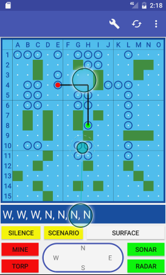
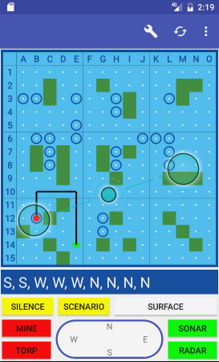
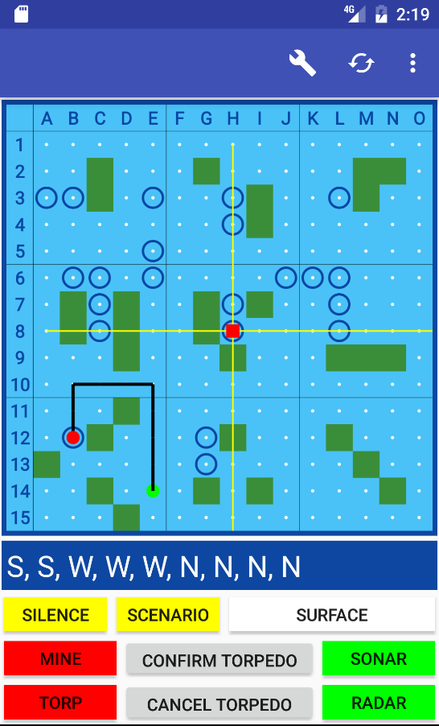
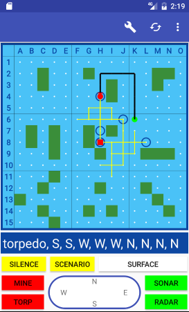
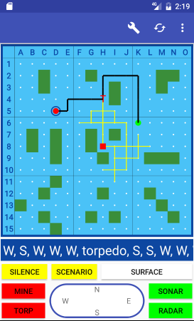
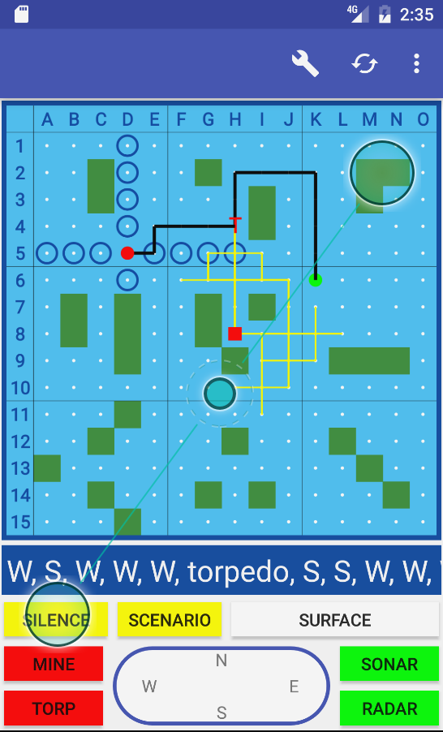

# captain-sonar-radar-companion
Welcome to the Captain Sonar Radar Companion. If you haven't
played the Captain Sonar board game, then watch this video.

https://www.youtube.com/watch?v=Yjo4iXyDPtw&t=57s

This application is a tool that takes over the Radar role.
You enter enemy movements and the tool helps you deduce
where the enemy might be. You might want to use this tool
if you already know all the radar tracking tricks and just
want to get on with the game already.

In the future this application may be extended so games can
actually be played. Or, maybe a mode will be added where you
play against an AI. Or (my favorite idea) this radar tracking
tool will allow for Multi-Band Radar Tracking. Multiple subs
could be in the same region at once and this tool would help
you track them all!! How cool would that be?

## The Board Game
Captain Sonar is a board game that simulates two submarines
hunting each other. Players each have a copy of a map of
water with islands interspersed everywhere. A divider goes
between the players so they can't see each others maps.
Players each choose a secret starting location, wherever
they want on the map, and then hunt each other down. Players
take turns announcing which way their sub is heading
(North, East, South, West). As players announce their
movements players to to deduce where the other player is
by drawing the path of their movements and making sure it
hasn't run into any islands.

In the physical board game each player has a transparent piece
of plastic. Players trace the path of the enemy submarine with
a marker and move the plastic around over the map looking to see
if the path goes through any islands. Tracking the enemy sub is
as fun as it is algorithmic!

## This Tool
This application is a tool that does radar tracking for you. Simply enter the
movements of the enemy submarine and see the map update with their current
possible locations.

The tool includes features to input information about torpedoes,
mines, using the Sonar and Radar abilities, and accounting for
the Silence ability.

When an enemy fires a torpedo at a coordinate the tool will cross
reference that coordinate with the currently known positions.

When an enemy drops a mine you'll see an "M" indicator on their
path. You'll be able to see where mines might be as you drag the
path around.

## The Interface
The green dot represents where the sub started. The red dot represents
where the sub is at the end of their path. The circled grid locations
represent all possible locations where the sub might currently be.

You can drag the path around inside the map view.

Press the torpedo button and crosshairs appear in the map. Drag the
crosshairs to the location where the torpedo was fired. Press "Confirm
Torpedo."

The tool cross references the torpedo coordinates with the possible
positions of the submarine. Any position that wasn't within firing
range will be eliminated.

There's a "T" left on the path that indicates where the sub fired
the torpedo from.

Press the "Silence" button when the enemy activates their ability to move
up to four spaces in any direction without revealing which direction they
went. You'll see the tool expand the current possible positions of the enemy
submarine.

## TODO
- custom map option
- option to switch path view off
- switch between possible current position & possible start positions
- torpedo mode doesn't always switch back to path mode properly
